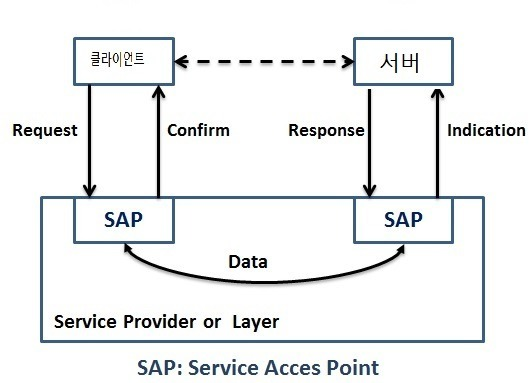

- [프로토콜의 정의](#프로토콜의-정의)
  - [프로토콜 형식](#프로토콜-형식)
  - [프로토콜의 종류](#프로토콜의-종류)
  - [계층 구조](#계층-구조)
    - [계층적 모듈 구조](#계층적-모듈-구조)
      - [장점](#장점)
    - [프로토콜 설계 시 고려 사항](#프로토콜-설계-시-고려-사항)
      - [주소 표현](#주소-표현)
      - [오류 제어](#오류-제어)
      - [흐름 제어](#흐름-제어)
        - [Stop-And-Wait](#stop-and-wait)
        - [Sliding Window (Go-Back-n ARQ)](#sliding-window-go-back-n-arq)
        - [흐름 제어 예](#흐름-제어-예)
      - [데이터 전달 방식](#데이터-전달-방식)
        - [단방향](#단방향)
        - [전이중](#전이중)
        - [반이중](#반이중)
    - [서비스 프리미티브](#서비스-프리미티브)

# 프로토콜의 정의

컴퓨터들 간의 원활한 통신을 위해 지키기로 약속한 규약. 프로토콜에는 신호 처리법, 오류처리, 암호, 인증, 주소 등을 포함한다.  

원활한 통신을 위해선 반드시 프로토콜을 통일시켜야 한다. 그래서 전세계에서 쓰이는 프로토콜을 통합시킨 국제 표준 통신규약이 존재한다. 이 표준 프로토콜은 UN 산하의 ITU라는 기관에서 국제통신규약을 만들어 사용한다.

---
 

## 프로토콜 형식

~~*마치 언어와 비슷하다

- 통신 단말기(장비) 사이에 정보를 전송하기 위한 통신 규약 혹은 표준 형식(Format) 이 있다.
- 각 Field 마다 의미(Semantic) 가 있다

---
 

## 프로토콜의 종류

인터넷이 전 세계에 연결되어 자유롭게 사용이 가능한 것도 다 프로토콜 덕분이다.
인터넷은 TCP/IP 기반하에 동작하는데 이 자체가 프로토콜이다. 인터넷을 통해서 전 세계로 이메일을 보낼 수 있는 것은, SMTP (Simple Mail Transfer Protocol)라는 게 규정되어 있고, 전 세계의 메일서버가 이를 따르기 때문이다. 월드 와이드 웹 역시, HTTP (HyperText Transfer Protocol) 이라는 것이 규정되어 있고, 웹 서버와 웹 브라우저가 이를 따르기 때문에 가능한 것이다.

- HTTPS
- HTTP
- feed
- tel
- mailto
- IPFS
- SMTP
- OSI 7 Layer(Reference Model)
- TCP/IP

---
 

## 계층 구조

### 계층적 모듈 구조

- 크고 복잡한 시스템을 기능별로 여러개의 독립적인 고유 기능을 수행하는 모듈로 나누고 상하위의 계층 구조로 연결되어 동작
- 모듈 사이의 적절한 인터페이스가 필요
 
- 상위 모듈이 하위 모듈에게 서비스를 요청
- 하위 모듈은 서비스를 실행하고 그 결과를 상위 모듈에 통보

#### 장점
- 전체 시스템을 이해하기 쉽고,설계 및 구현이 용이
- 모듈간 표준 인터페이스가 단순하면 모듈의 독립성을 향상시킬 수 있으며, 이는 시스템 구조를 단순화시키는 장점이 됨
- 대칭구조에서는 동일 계층 사이의 인터페이스인 프로토콜을 단순화 시킬 수 있음
- 특정 모듈의 외부 인터페이스가 변하지 않으면 내부 기능의 변화가 전체 시스템의 동작에 영향을 미치지 않음

---
 

### 프로토콜 설계 시 고려 사항

#### 주소 표현

주소의 역할: 서로를 구분
주소의 활용도를 높이기 위해 구조적 정보를 포함시킬 수도 있음
ex) 전화번호, 주민번호
1:다 통신 지원
- Broadcast : 모든 호스트에 데이터 전달
- Multicast : 특정 호스트에 데이터 전달
- 

#### 오류 제어
- 데이터 변형 오류 : 데이터가 깨져서 수신자에게 도착
- 데이터 분실 오류 : 데이터가 수신자에게 도착하지 못함
- 데이터 링크 계층의 주요 기능으로 재전송 방식을 사용 
전송 오류 문제를 해결하는 오류 제어Error Control 기능은 통신 프로토콜의 가장 기본적인 기능에 속한다.

#### 흐름 제어

일반적으로 수신 호스트의 버퍼 처리 속도보다 송신 호스트가 데이터를 전송하는 속도가 빠르면 논리적인 데이터 분실 오류가 발생할 수 있다.
수신 버퍼가 부족하면 분실처리가 됨
이 문제를 해결하려면 송신 호스트의 전송 속도를 조절하는 흐름 제어Flow Control 기능이 필요하다.

##### Stop-And-Wait

- **매번 전송한 패킷에 대한 확인 응답을 받아야만 그 다음 패킷을 전송**하는 기법
- 

##### Sliding Window (Go-Back-n ARQ)

- 수신측에서 설정한 **윈도우 크기만큼 송신측에서 패킷 각각에 대한 확인 응답없이 세그먼트를 전송**하게 하고, 데이터 **흐름을 동적으로 조절**하는 기법
- 

##### 흐름 제어 예
  1.  **송신 버퍼**

  

  -   200 이전 바이트는 전송 성공했고, 확인 응답을 받은 상태
  -   그런데 **200~202 바이트는 아직 확인 응답을 받지 못한 상태**
  -   203~211 바이트는 아직 전송이 되지 않은 상태

    

  2.  **수신 윈도우**

  

    

  3.  **송신 윈도우**

  

  -   **수신 윈도우보다 작거나 같은 크기로 송신 윈도우를 지정**하여 흐름제어

    

  4.  **송신 윈도우 슬라이딩 (이동)**

  

  -   Before 에서 **203~204를 전송**하면 수신측에서는 **확인응답 203**을 보내고, 송신측은 이를 받아 After 상태와 같이 송신 **윈도우를 203~209로 이동**함
  -   After 는 **205~209가 전송 가능한 상태**

 

#### 데이터 전달 방식

##### 단방향
- 한쪽 방향으로만 전송하는 것을 단방향 (Simplex)

##### 전이중
- 양쪽에서 데이터를 동시에 전송하는 것을 전이중 (Full Duplex)
- 일반적인 통신 프로토콜들은 모두 전이중 방식을 지원한다. 

##### 반이중
- 데이터가 양방향으로 전송되지만 특정 시점에는 한쪽 방향으로만 전송할 수 있는 반이중 (Half Duplex)
- 반이중 방식에서는 양쪽에서 데이터를 동시에 전송할 수 없으므로, 데이터 전송 시점을 제어할 수 있어야 한다.

 

---

### 서비스 프리미티브
- OSI 7 Layer 및 TCP/IP 의 상위 계층과 하위 계층의 서비스 요구,지시,응답,확인 통한 계층 통신 기능

    
    #### 프리미티브의 종류와 기능
    - 연결형 서비스 : 데이터 전송 전에 미리 연결을 설정하는 방식 (CONNECT,DATA,DISCONNECT)
    - 비연결형 서비스 : DATA
    - 서비스 프리미티브의 기능

|신호 종류|역할|설명|
|------|---|---|
|요구 (Request)|서비스 이용|클라이언트->서버 서비스의 개시 요구 : N+1 → N 계층 간 통신|
|지시 (Indication)|서비스 제공|서버에 요구가 도착 서비스 개시 됨 표시 : N → N+1 계층 간 통신|
|응답 (Response)|서비스 이용|서버 -> 클라이언트 지시에 의해 서비스 수행 : N+1 → N 계층 간 통신|
|확인 (Confirm)|서비스 제공|클라이언트에 응답 도착 통지 : N → N+1 계층 간 통신|

서비스 프리미티브에 의해 상위 계층은 하위 계층의 서비스를 이용하며, 하위 계층은 상위 계층에 서비스를 제공하는 형태

 
 

다음 ->  [03. OSI 7 Layer](03_OSI7Layer.md)