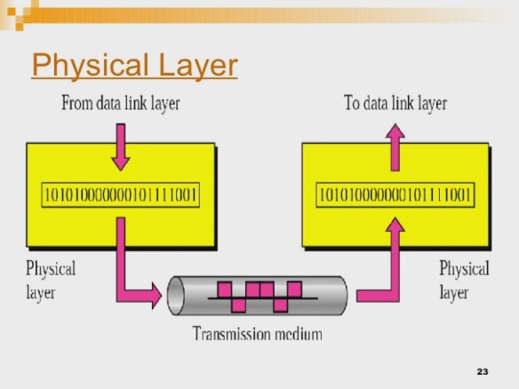

# ISO의 OSI(Open System Interconnection) 7계층 모델

## 개요
    OSI 모형(Open Systems Interconnection Reference Model)은 국제표준화기구(ISO)에서 개발한 모델로, 컴퓨터 네트워크 프로토콜 디자인과 통신을 계층으로 나누어 설명한 것이다. 일반적으로 OSI 7 계층이라 불리기도 한다.

    각 계층은 헤더와 데이터 단위(Data Unit, Protocol Data Unit)으로 정의 됨
    헤더에는 각 계층의 기능과 관련된 정보가 포함된다.
    송신측이 헤더를 생성하여 추가하면 수신측에서 해당 계층이 이 헤더를 사용한다.

상위 계층이나 하위 계층 사이에서 주고받는것을 **서비스 데이터 단위(SDU)** 라고 하고, 같은 계층 사이에서 주고받는 것을 **프로토콜 데이터 단위(PDU)** 라고 한다.

### 용어 정리
- 계층n 프로토콜: 계층 n 모듈끼리 사용하는 통신 규칙
- 동료 프로세스 : 동일 계층에 위치한 통신 양단 프로세스
- 인터페이스 : 상하위 계층 사이의 접속 방법
- 서비스 : 상위 계층이 하위 계층을 사용하는 방법
- 프로토콜 데이터 단위
  - APDU : 응용 계층의 데이터 단위
  - PPDU : 표현 계층의 데이터 단위
  - SPDU : 세션 계층의 데이터 단위
  - TPDU : 전송 계층의 데이터 단위
    - 세그먼트 : TCP 프로토콜에서 사용
    - 데이터그램 : UDP 프로토콜에서 사용
  - NPDU : 네트워크 계층의 데이터 단위 ***패킷(Packet)***
  - DPDU : 데이터 링크 계층의 데이터 단위 ***프레임(Frame)***

### 헤더의 정보
- 송신 호스트 : 데이터가 상위 계층에서 하위 계층으로 갈수록 헤더 추가
- 수신 호스트 : 데이터가 하위 계층에서 상위 계층으로 갈수록 헤더 제거

## OSI 참조 모델의 데이터 전송

### 계층별 PDU
- 보통 데이터 단위를 패킷이라고 하는데, OSI 참조 모델 데이터 링크 계층의 PDU는 프레임, 네트워크 계층의 PDU는 패킷, 전송 계층의 PDU는 세그먼트로 라벨을 붙인다.

### 헤더와 트레일러
- OSI 참조 모델에서 데이터는 응용 계층에서 하위 계층으로 순차적으로 전송되는데, 물리계층과 응용계층을 제외한 나머지 계층에서는 데이터의 시작부분과 끝부분에 헤더나 트레일러 형태로 정보를 추가한다.
- 시작 부분에 추가되는 헤더는 데이터링크계층(L2),네트워크계층(L3),전송계층(L4),세션계층(L5),표현계층(L6)의 데이터에 추가되고, 끝부분에 추가되는 트레일러는 데이터링크계층(L2)에만 추가됨

### 네트워크 프로토콜
 *실제 네트워크 프로토콜은 OSI 참조 모델의 7계층을 모두 사용하지 않고, 물리 데이터 네트워크 계층만 사용*

--- 
 
 
 

## 물리 계층(Physical Layer)(L1)
- 물리 계층은 실제 장치들을 연결하기 위해 필요한 전기적, 물리적 세부 사항들을 정의한다. 예를 들어, 핀들의 배치나 전압, 전선의 명세 등이 이 계층에 포함된다. 허브(리피터)가 물리 계층의 장치이다.
- 예를  들어서 ‘1’을  판정할  때에  몇 V 이상인가에  대한  정의가  여기에 속한다.

단위 - bit

대표 장치
- 동축케이블, 안테나, Hub, 리피터
  
프로토콜
- 이더넷, USB 등 케이블 , Bluetooth, Wi-Fi, LTE, 5G 등 안테나

---

## 데이터 링크 계층(Data Link Layer)(L2)

- 데이터 링크 계층은 포인트 투 포인트(Point to Point) 간 신뢰성 있는 전송을 보장하기 위한 계층으로 순환 중복 검사(CRC) 기반의 오류 제어와 흐름 제어가 필요하다. 네트워크 위의 개체들 간 데이터를 전달하고, 물리 계층에서 발생할 수 있는 오류를 찾아 내고, 수정하는 데 필요한 기능적, 절차적 수단을 제공한다. 주소 값은 물리적으로 할당 받는데, 이는 네트워크 카드가 만들어질 때부터 맥 주소(MAC address)가 정해져 있다는 뜻이다. 주소 체계는 계층이 없는 단일 구조이다. 데이터 링크 계층의 가장 잘 알려진 예는 이더넷이다. 이 외에도 HDLC나 ADCCP 같은 포인트 투 포인트(point-to-point) 프로토콜이나 패킷 스위칭 네트워크나 LLC, ALOHA 같은 근거리 네트워크용 프로토콜이 있다. 네트워크 브릿지나 스위치 등이 이 계층에서 동작하며, 직접 이어진 곳에만 연결할 수 있다.

- 이더넷, USB, Bluetooth, Wi-Fi 같은 통신 규격서안에 대부분 데이터 링크 계층도 같이 포함한다. L1~L2는 IEEE, 3GPP 등에서 표준을 관리한다.

단위 - frame

대표 장치 - L2 Switch, 모뎀, 기지국, 인터넷 공유기, Wi-Fi 공유기

프로토콜 : CSMA/CD, CSMA/CA, Slott Aloha, DAC/ADC, Multiplexer, Demultiplexer, MAC주소 관리 등

